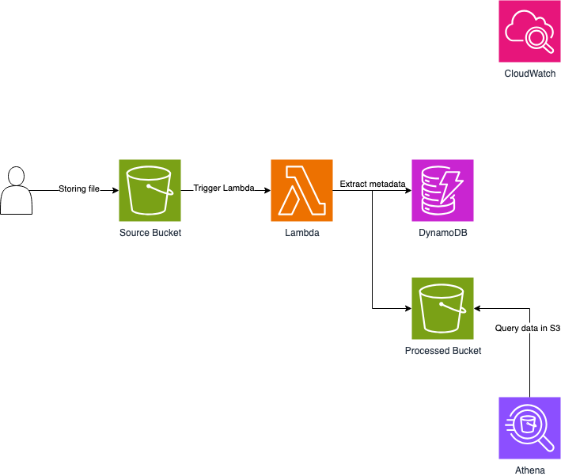

# Serverless Metadata Extraction

## 📌 Project Overview
The **Serverless Metadata Extraction** project is a lightweight, AWS-based serverless solution that automatically extracts metadata from uploaded files (e.g., images, text, documents) and stores it in **Amazon DynamoDB** for easy querying.  

This solution eliminates the need for manual metadata processing and enables fast, scalable, and cost-efficient lookups of file information.

---

## ✨ Key Features
- **Automatic metadata extraction**
  - Triggered by file upload to **Amazon S3**
  - Supports images, text, and other file types
- **Serverless design**
  - **AWS Lambda** handles file processing
- **Scalable storage**
  - Metadata stored in **Amazon DynamoDB**
- **Easy querying**
  - Users can query extracted metadata directly via DynamoDB API/console

---

## 🏗️ Architecture Overview

### Components
- **S3 Source Bucket**  
  - Stores uploaded files (images, text, etc.)
- **AWS Lambda**  
  - Triggered by `S3:ObjectCreated` events  
  - Extracts metadata (file type, size, timestamp, custom attributes)
- **Amazon DynamoDB**  
  - Stores metadata records for fast querying
- **User Query Access**  
  - Users can query metadata through DynamoDB

---

## 🔄 Processing Flow
1. **File Upload**  
   A file (image, text, document) is uploaded to the S3 source bucket.  

2. **Lambda Trigger**  
   S3 event automatically triggers a Lambda function.  

3. **Metadata Extraction**  
   Lambda extracts file properties such as:  
   - File name & path  
   - File type (e.g., image/jpeg, text/plain)  
   - File size  
   - Upload timestamp  
   - Custom metadata if available  

4. **Storage & Querying**  
   Extracted metadata is stored in **DynamoDB**, where it can be queried by users.

---

## 💡 Use Cases
- Automating file cataloging for media libraries  
- Tracking document metadata in content management systems  
- Building searchable indexes for uploaded assets  
- Enabling audit/logging pipelines for file storage  

---

## ⚡ Live Demo

1. Upload a file to the **S3 source bucket**.  
2. Lambda is triggered and extracts file metadata.  
3. Metadata is stored in **DynamoDB**.  
4. Query metadata via DynamoDB API, CLI, or Console.  

